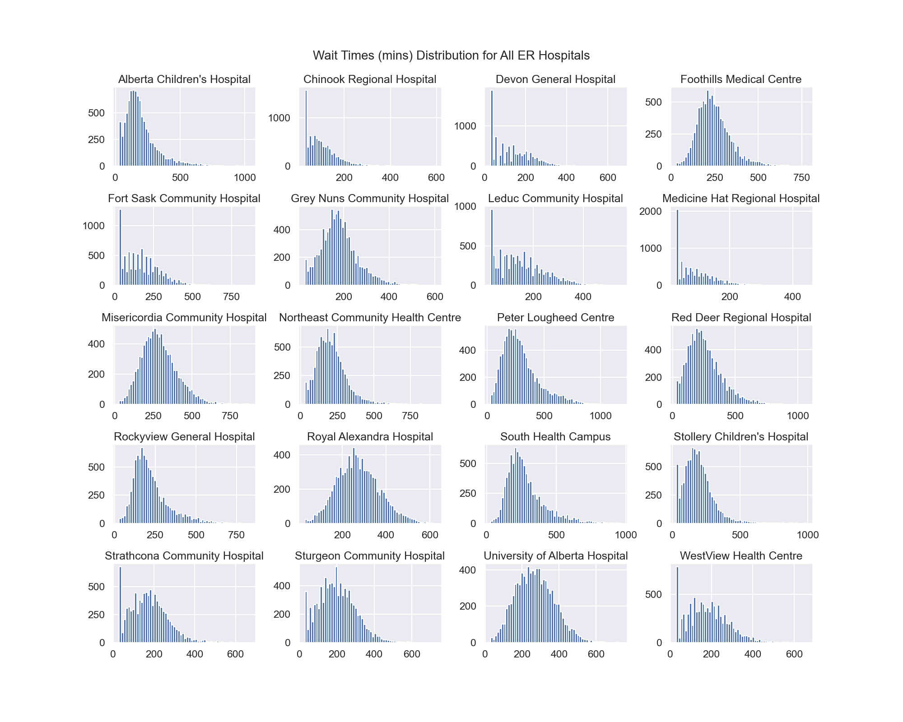
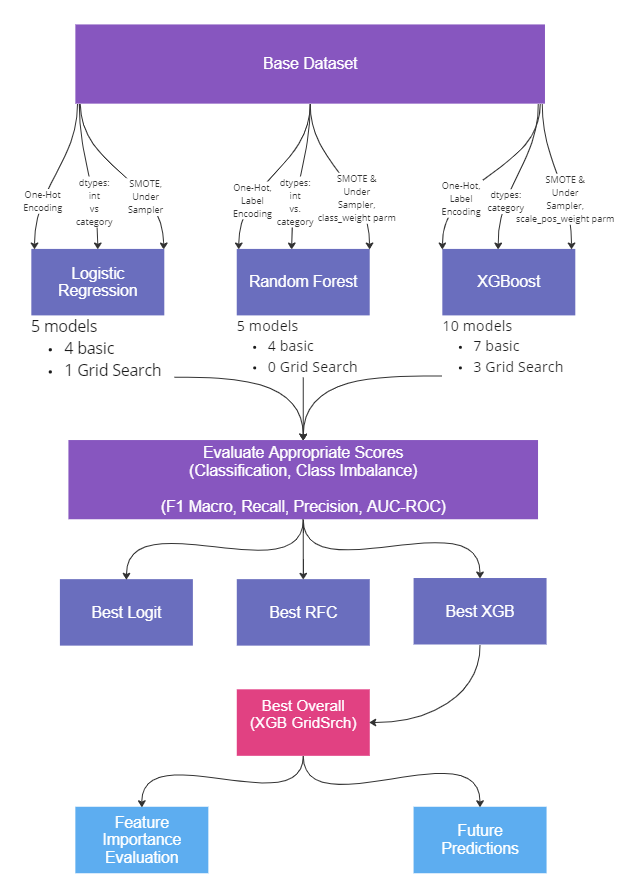

# Alberta ER Wait Times Analysis & Predictive Modeling: Final Project

This is a final project for Lighthouse Labs data science program wherein I complete data analysis and machine learning model building to explore Alberta ER Wait Times (instantaneous times captured from https://www.albertahealthservices.ca/waittimes/waittimes.aspx) between September 24, 2022 and November 22, 2023.

Please see the [About the Data](#about-the-dataset) section to read about the provenance of the dataset used in this project.

## Project Goals

To do data analysis, visualizations, statistical testing and build predictive models based on the ER Wait Times dataset, to explore trends and patterns in Alberta Emergency Room wait times.

Initial Guiding Questions:
* Is there a wait time trend dependant upon neighbourhood, time of day or time of year?
* Is there a high "accuracy" predictive model that could train on this data and be refined to ultimately help inform hospital resourcing decisions?
* Are there surprising findings that come out of the analysis and model building (and evaluation) that we never expected?

## Project Deliverables

### Exploratory Data Analysis & Statistical Tests

Descriptive statistics were generated. Exploratory plots describing the data were also drawn. Simple statistical tests to determine if mean wait times across different hospitals, different days of week, different weeks of year, and different day periods, differed significantly.

See file [`erwait_eda_hypothesis_testing.ipynb`](src/erwait_eda_hypothesis_testing.ipynb).

One interesting overall summary plot from the aforementioned notebook is the distribution of wait times (in minutes) for each Alberta hospital with an Emergency Department:

</img>

### Classifier Model Built

This project built several Logistic Regression classification models aimed at predicting the outcome of "experiencing a long wait at the ER", with input parameters involving features from the dataset such as:
* hospital
* city
* city type (urban or rural)
* hour of day of visit
* week of year of visit
* day period of visit (day, evening, or night)
    * 'night'   :  00h00 to 07h59, inclusive
    - 'day'     :  08h00 to 15h59, inclusive
    - 'evening' :  16h00 to 23h59, inclusive

The model types explored were: `LogisticRegression`, `RandomForestClassifier`, `XGBoostClassifier`.

See files [`erwait_model_logit.ipynb`](src/erwait_model_logit.ipynb), [`erwait_model_randomforestclassifier.ipynb`](src/erwait_model_randomforestclassifier.ipynb) and [`erwait_model_xgboost.ipynb`](src/erwait_model_xgboost.ipynb).

#### What was the Best Model?

The very best classifier was an XGBoostClassifier built with GridSearchCV, using a SMOTE and RandomUnderSampler approach to deal with class imbalance, and with the `hour` and `weekofyear` X variables `Label Encoded` and the remainder of the categorical features one-hot encoded.

### Project Approach

The project followed this general approach:

</img>

### Model Evaluation

The evaluation of all models is in [`erwait_evaluation_all_models.ipynb`](src/erwait_evaluation_all_models.ipynb).

## Project Outcomes
1. Basic descriptive statistics and exploratory data analysis on the raw data indicate, similar to the McMaster University data 4 referenced in the [How was 'Long Wait' determined](#how-was-long-wait-determined) section below, that the CAEP 1 and CTAS 2 recommendations are being far exceeded in our Alberta ERs.
    - My choice of the "long wait" threshold of 400 minutes **far exceeds** the CAEP guideline of 3 hours at 90th percentile 2.
    - A "true outlier" (`Q3 + 1.5 * IQR`) is 502.5 minutes, which means that our Alberta wait times across the province are generally quite high.
    - Mean wait times across hospitals are exceeding the CAEP 2 guideline.

2. The best classifier model predicted feature importances indicate high level that these are important factors to determining whether a 'long wait' will occur:
    * specific hospital
    * rural vs. urban location
    * day period (night, specifically: 00h00 to 07h59, inclusive)

</img>

3. The histograms drawn in EDA show that there are many differences in median wait time across hospitals, and presence of right skew (long wait times) in some hospitals.

4. Plots and statistical tests showed significant differences in mean wait time between day of week for certain hospitals, including the apparent fact that for the hospitals that tend to have the least likelihood of long wait times, the weekends (Sat, Sun) mean wait times are significantly lower than weekday.

5. The 'night' dayperiod (00h00 to 07h59, inclusive) in the EDA plots tends to have a statistically lower mean wait time. The best classifier model's feature importances also demonstrated that the 'night' period also played a significant role in gain/purity of the splits of the tree.

6. From `predict_proba()` calculations on generic data representing "every hour, for every day, for every week of the year" (8736 rows), in a notebook that was not included in this repository, the % incidence of predictions with a >90% probability of long wait time was low or under 10% for most hospitals, but reasonably high in certain hospitals, specifically:
    - Peter Lougheed Centre in Calgary (22% incidence, 1952 occurrences over 8736 rows)
    - South Health Campus (18% incidence, 1535 occurrences over 8736 rows)
    - Red Deer Regional Hospital (13% incidence, 1171 occurrences over 8736 rows)
    - Misericordia Community Hospital (12% incidence, 1032 occurrences over 8736 rows)
    
        - It would be interesting to re-run this after re-building a new, more reliable model (perhaps with the classification problem defined as "is the wait more than 3 hours, the recommended wait (at 90th percentile) by the CAEP?", or "is the wait longer than average for the entire dataset?"), and predicting on the  generic input data covering every hour, for all days, for all weeks in a generic year (see [Future Exploration](#future-exploration) section below.
        - It would also be interesting to dig into why these 4 hospitals with the highest "incidence of > 90% probability of having a long wait" have such high values compared to other hospitals, especially.

### Technical Discoveries
1. Model performance differences are quite impacted by the way the input data is prepared/treated before being fed the model, specifically:
    - Over and under sampling to treat class imbalance
    - Label/Ordinal vs. One-Hot Encoding
    - Dropping collinear data (obviously!)

2. Generally, in terms of performance: simple LogisticalRegression < RFC < XGB.
    - Moving from a GridSearched Logistic Regression model to even a simple RFC model using only default instantiation parameters gave a surprising boost to performance with relatively no investment. Similarly, moving from an RFC to a basic XGB classifier with default parameters gave a performance boost with little extra investment.

3. RFC grid search is computationally (and memory) expensive. Of the 4 attempts at GridSearchCV runs, each with reduced `param_grid` options, none finished, even though 2 of those runs were attempted on a GPU from Google Colab.

## How was the "Long Wait" Threshold determined?
I chose 400 minutes as the threshold for calculating the target variable, "long wait".

I consulted 4 sources to determine the guidelines for wait time, as follows:

1. <a href="https://ctas-phctas.ca/wp-content/uploads/2018/05/ctased16_98.pdf">Implementation Guidelines for The Canadian Emergency Department Triage & Acuity Scale (CTAS)</a>, December 1998
2. Canadian Association of Emergency Physicians (CAEP) Position Statement, 2013:
<a href="https://caep.ca/wp-content/uploads/2016/03/cjem_2013_overcrowding_and_access_block.pdf">"Emergency department overcrowding and access block"</a>
3. Alberta Health: <a href="https://open.alberta.ca/dataset/c7e3fc16-7aea-455c-96a1-20811a640b1a/resource/e2f49c22-3390-48a3-ac74-278a932aa668/download/pmd-ed-time-physician-initial-assessment.pdf">ED Time to Physician Initial Assessment (TPIA): Performance Measure Definition Alberta</a>, February 2015
4. <a href="https://www.longwoods.com/content/26333/healthcare-quarterly/physician-initial-assessment-times-based-on-ctas-scores-are-we-meeting-the-recommendations-">Physician Initial Assessment Times Based on CTAS Scores: Are We Meeting the Recommendations?</a>

### CTAS Recommendation: <= 2 hours

Though a dated reference, (1) discusses the CTAS score, which is still utilized in emergency departments today. The implementation guideline specifies a **<= 2 hours** "time to physician" recommendation for the lowest, Level V, "Non Urgent" triage score.

</img>

### CAEP Recommendation: 1 hour at median, 3 hours at 90th percentile

(2) is a more recent publication by the CAEP and defines the **Time to PIA** as below. This "PIA" is the interval that the Wait Times in this dataset are also measuring.

</img>

</img>

### Alberta Health Benchmark Comparisons: Wait Time for Physician Assessment (2012-13)
- ***National Sites: 3.2 hours***
- ***Alberta Sites: 3.1 hours***

(3) indicates that in 2012-13, wait times to physician assessment were at the 3.2 hour mark on average.

</img>

### McMaster University research in 2016-17: Low Compliance with Recommended PIA Times

(4) observes that there is low compliance with recommended PIA times observed in Ontario in 2016-17. Therefore, the published recommendations from (1), (2) and (3) may not be reasonable to use figures past which we define a 'long wait' as. Certainly, the exploratory data analysis and descriptive statistics on the raw dataset indicate that the median wait across all hospitals is 192 minutes (3.2 hours) and mean wait 207 minutes (3.45 hours), far exceeding the recommendations in (1) and (2).

### Conclusion: Decide to Define 'long wait' as > 400 minutes

The threshold for outliers (`Q3 + 1.5 * (IQR)`) for this dataset is 502.5 minutes.

Conservatively, I chose an arbitrary but informed (from consideration of above) threshold of 400 minutes (6h40m) wait as the threshold to define as a 'long wait'.

## Future Exploration 

The following are some ideas for future enhancement and exploration:

### 1. Remove Collinear Features & Retrain Model

It would be useful to re-train an XGB model with a much simplified dataset, removing collinear items, since the feature importance scores highlighted several collinear features repeatedly affected gain scores (example: `city_Medicine Hat` and `id_mhrh` (i.e. Medicine Hat Regional Hospital) both made it into the Top 10.

    The next model would include simply include hospital, hour, and week of year and would not include city, citytype (rural/urban) or day period measures, since those are derivable from the core features. This may simply and improve clarity of feature importance scores.

### 2. Change Threshold for Classification Problem & Retrain Model

Retrain the model after moving the threshold for "long wait" to be closer to the mean or median across all hospitals in the dataset, and change the target variable to "longer than mean wait time" or "longer than national guideline wait time".

    This would solve for class imbalance, and thereby should improve Precision (improve F1 score) and is perhaps a more interesting prediction since most people are not asking "Is my wait going to be longer than 6h40m (close to 7 hours)?" when they attend the ER, but rather something closer to, "Will I have an above averag- wait time?" or "Will I have a longer than recommended-by-national-guidelines wait time?".

### 3. Use the Model to Look at Incidence of "Long Wait" or "Above Average Wait" or "Above Guideline Wait"

Generate a generic input data set which includes a row for every hour, on every day, in every week, of a generic year, for every hospital.

Feed this generic data set into a revised and more "accurate" (high F1 score) model, and obtain the `predict_proba()` on the entire dataset.  Merge the columns "Probability of Class 0" and "Probability of Class 1" into the original generic dataset, then perform EDA and plotting on this dataset, calculating the "% incidence of a > 80% (or whatever threshold we wish) probability of having a long, or above-average, or above-guideline wait time" per hospital, per city, per week or year, per day of week, or other ways of "slicing" the data.

    This analysis could be examined across hospitals, across cities, across urban vs. rural divides, and so on.

    Though this has been done preliminarily in a notebook not included in this GitHub, a more formalized approach with accompanying plots, might yield intriguing and "generalized" (predictive) results.

### 4. More Deeply Investigate "Proper" and "Recommended" Pre-Processing and Encoding of Input Data for XGBoost Models

Given that the treatment of the data prior to feeding to various model classes significantly impacted the model performance, it would be good to more deeply investigate how to properly deal with featuers like `hour` and `weekofyear` properly: one-hot encoding (leading to a blow-up of dimensionality) vs. label encoding (which in some ways functions like ordinal encoding in a variable that has no ordinal ordering). During this project, my investigation yielded various and sometimes divided opinions from practitioners.

    It would be nice to have a longer time to more thoroughly understand the theoretical guidelines and what works best with the model, specifically an XGBoost model.

### 5. Obtain more raw data that includes July.

The present dataset was missing data from Weeks 28, 29, and 30 which correspond to Stampede time in Calgary, which may have shown higher wait times.

### 6. Add Additional Feature Engineered Data

Procuring and adding (or feature engineering) additional data for the X variables may enable us to turn this problem back to a linear regression.

Some examples:

- some measure of the ratio of hospital ER and/or beds capacity to population size
- weather data for the time periods
- accident report or counts data for the time periods

### 7. Explore and perform a Time Series analysis

Since the data is functionally a Time Series, prediction on wait time could occur by utilizing Time Series models.

## About the Dataset

The ER Wait Times dataset for this project is property of the Canadian Broadcasting Corporation (CBC).
* Primary source is Alberta Health Services, from their <a href="https://www.albertahealthservices.ca/waittimes/Page14230.aspx">Estimated Emergency Department Wait Times</a> website, which the CBC has aggregated and visualized in these news articles:
    * <a href="https://www.cbc.ca/news/canada/calgary/calgary-er-wait-time-tracker-cbc-1.6701714">CBC News Online: How are wait times at your local hospital?  Track Calgary and area emergency rooms here</a>
    * <a href="https://www.cbc.ca/news/canada/edmonton/edmonton-er-wait-time-tracker-cbc-1.6708480">CBC News Online: How are wait times at your local hospital?  Track Edmonton and area emergency rooms here</a>

The CBC's full raw dataset underlying the plots shown in their news articles linked above has been provided to me courtesy of the CBC for the purposes of this data science program project. My thanks to Robson Fletcher for sharing the dataset.

***The raw dataset is not available on this GitHub site.***

CBC's Journalistic Standards and Practises can be found here.  Expand the `Data Journalism` dropdown for pertinent information.
* https://cbc.radio-canada.ca/en/vision/governance/journalistic-standards-and-practices/sources

## Brief Note about How Alberta Health Calculates the Wait Times Displayed on their Website

The below is a screen capture from the <a href="https://www.albertahealthservices.ca/waittimes/Page14230.aspx">Alberta Health Services Estimated Emergency Department Wait Times</a> website and shows that what is more or less being calculated is the patient to physician ratio, with an assumption that a physician can see a patient every 30 minutes:

</img>